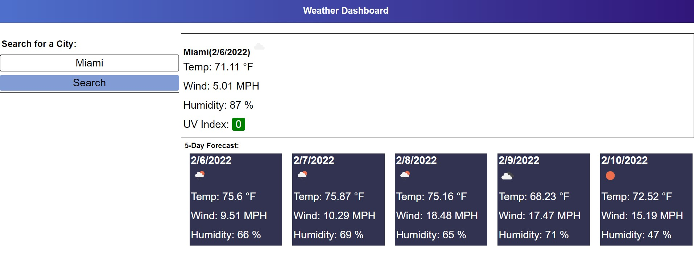

# Weather Dashboard

[Weather Dashboard Page](https://luise115.github.io/WeatherDashboard/)

## Description
Weather Dashboard is a page that lets you enter a desire city and get the current weather forecast and the next 5 day forecast.
 
 
With the implementation of [Map Quest API](https://developer.mapquest.com) and [Open Weather API](https://openweathermap.org) lets you enter a desire city to retrive their coordinates and call weather api to display weather forecast.

## Features
[Map Quest API](https://developer.mapquest.com)  
[Open Weather API](https://openweathermap.org)  

### Preview
